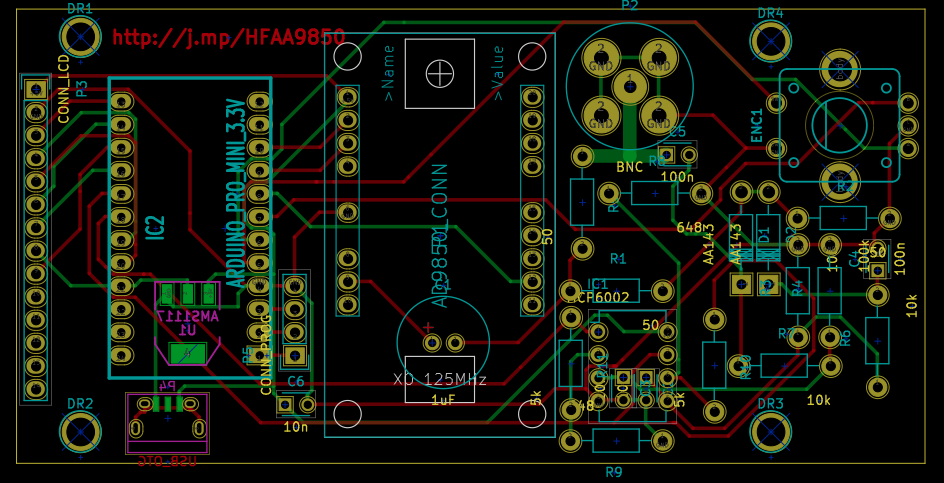
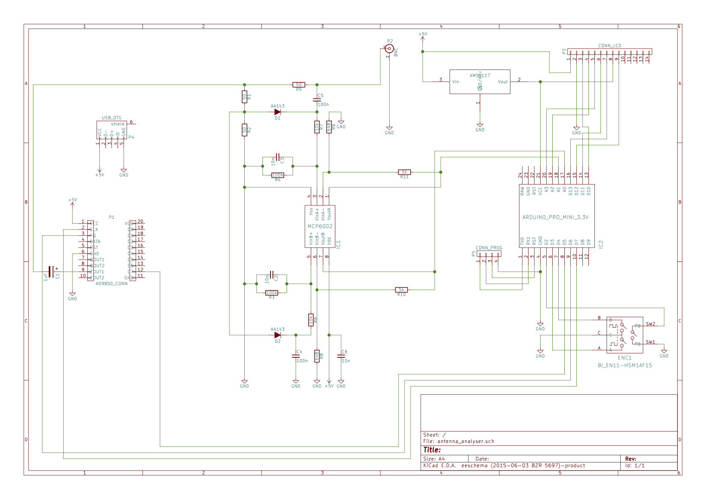
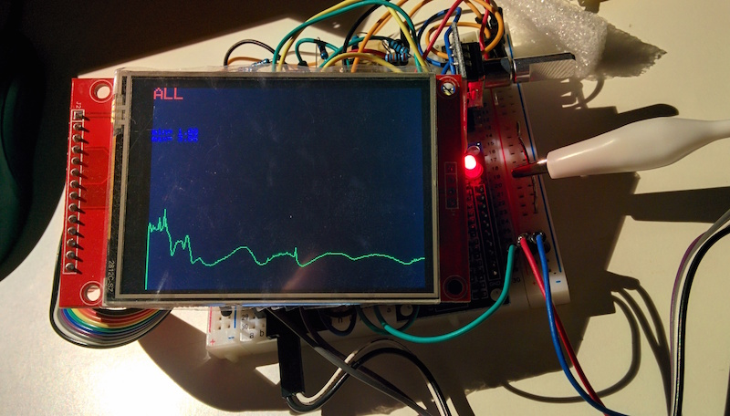
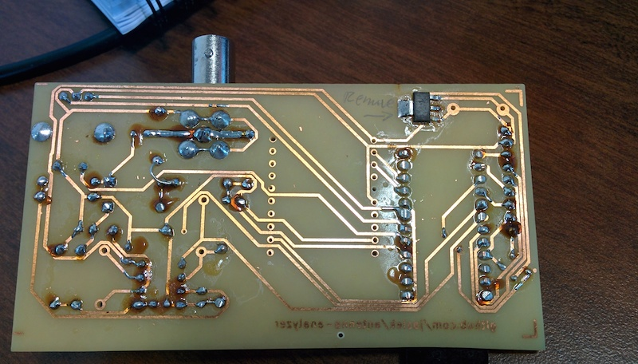
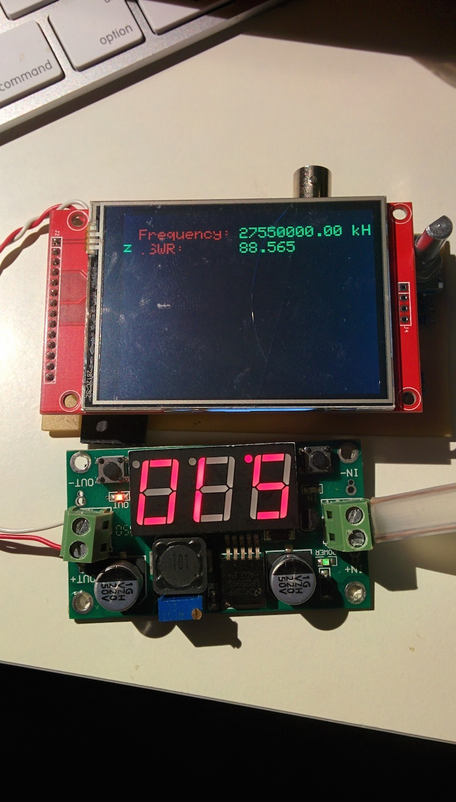
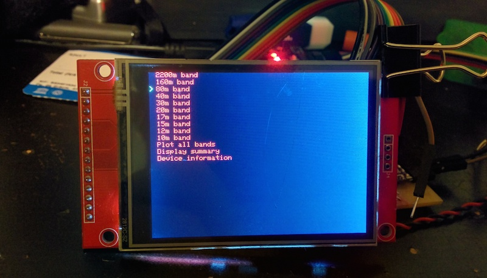
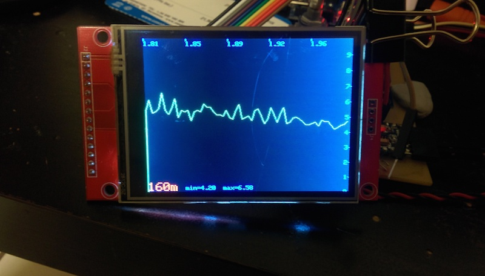
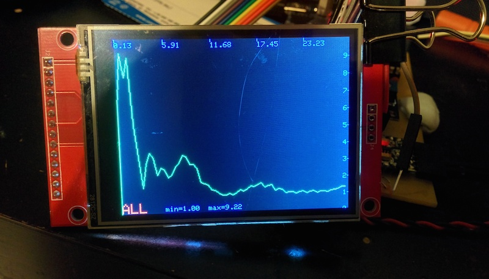
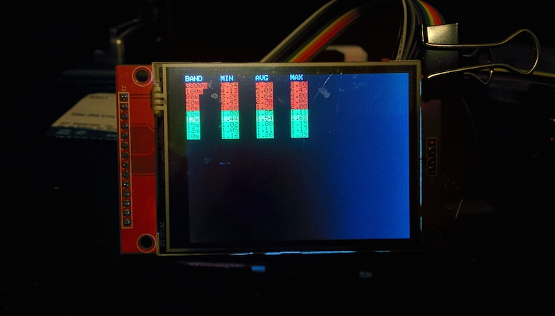

# antenna-analyser

There's a few projects like this one out there on the net. My goal was to create one that would be properly productized - eg.
with a PCB ready to be made and a parts list that can be easily obtained on eBay, etc.

The circuit is [K6BEZ's design](https://sites.google.com/site/k6bezprojects/antenna-analyser), and uses
an [Arduino Pro Mini](https://www.arduino.cc/en/Main/ArduinoBoardProMini), running at 8Mhz and 3.3V with
a cheap [SPI LCD TFT display](http://www.electrodragon.com/product/eds-tft-lcd-lcm-spi-interface-variable1-82-2)
to graphically represent the results of VSWR analysis.

I've bundled everything together into one repository so that the project can quickly be opened up in [KiCad](http://www.kicad-pcb.org/)
and the Arduino IDE.

## A few photos of the first prototype

## A few shots of the UI

## TODO

* Build and test this branch as a functional, physical prototype.
* ~~Improve menu structure and navigation.~~
* ~~Improve single band plot (move band label, min, max to the bottom). Notify the user when done plotting.~~
* When plotting all bands, plot amateur bands using a different colour.
* ~~Improve summary view, label columns, shorten frequency label.~~
* Add menu which lists 20 SWR minima across the band.

